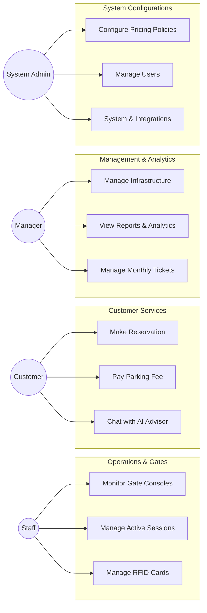

# Parking Management System (PBMS) - Use Case Documentation
This document defines the complete set of Actors and Use Cases for the Parking Management System, covering all aspects of operations, management, customer services, and configuration.
---
## 1. Actors List
### Primary Actors (Human)
*   **Customer / Guest:** The end-user who parks their vehicle, views availability, makes reservations, and pays parking fees.
*   **Staff (Gate Operator):** The operational employee stationed at the parking gates or control room. Responsible for monitoring entries/exits, managing active sessions, and handling physical RFID cards.
*   **Manager:** The supervisor responsible for overseeing parking operations, managing infrastructure (zones, slots), handling financial reporting, resolving disputes/incidents, and approving monthly tickets.
*   **System Admin:** The technical administrator responsible for system-level configurations, pricing policies, user roles, security, and third-party integrations.
### Secondary Actors (System/Hardware)
*   **IoT Hardware:** Physical devices (Cameras/ALPR, RFID Readers, Loop Detectors, LED Displays) that send signals to the system.
*   **Background Scheduler (Cron Job):** Automated system agent that executes time-based tasks (e.g., detecting overstays, expiring tickets).
*   **Payment Gateway (PayOS / PayPal):** External third-party systems that process and verify online financial transactions.
---
## 2. Use Cases Grouped by Actor
### 2.1. System Admin
*   **UC-ADM-01: Manage Building Profile** (Update building name, address, total capacity)
*   **UC-ADM-02: Configure System Variables** (Set thresholds like `OVERSTAY_HOURS_LIMIT`, `RESERVATION_EARLY_MINS`)
*   **UC-ADM-03: Manage Users & Roles** (Create, update, disable staff/manager accounts, assign permissions)
*   **UC-ADM-04: View Audit Logs** (Track user actions, IP addresses, session details)
*   **UC-ADM-05: Test 3rd-Party Integrations** (Execute SMTP, PayPal, PayOS, and Gemini AI test calls)
*   **UC-ADM-06: Manage Vehicle Types** (Add/Edit vehicle types and upload custom icons)
*   **UC-ADM-07: Manage Pricing Policies** (Configure complex pricing logic including base fees, max caps, shifts, and block intervals)
### 2.2. Manager
*   **UC-MGR-01: Manage Infrastructure** (Add/Edit/Delete Floors, Zones, Slots, and Gates)
*   **UC-MGR-02: Configure Smart Routing Rules** (Toggle routing per zone, set priority, set capacity warnings)
*   **UC-MGR-03: Configure Map Topology** (Upload coordinates for real-time visual maps)
*   **UC-MGR-04: Manage Monthly Tickets** (Register, renew, edit license plates, lock tickets)
*   **UC-MGR-05: Manage Vehicles & Blacklist** (View vehicle history, Add/Remove license plates from Blacklist)
*   **UC-MGR-06: Resolve Reservation Conflicts** (Handle scenarios where reserved slots exceed physical capacity)
*   **UC-MGR-07: Manage Incident Tickets** (Review, comment, and resolve issues reported by staff/system)
*   **UC-MGR-08: View Revenue & Traffic Reports** (Export CSV, view peak hours, breakdown revenue by type)
*   **UC-MGR-09: Process Refunds** (Handle monetary refunds for cancelled prepaid reservations)
### 2.3. Staff (Gate Operator)
*   **UC-STF-01: Clock In / Clock Out** (Manage work shifts)
*   **UC-STF-02: Monitor Gate In Console** (Verify ALPR/RFID, validate Blacklist/Ticket, create session, open barrier)
*   **UC-STF-03: Monitor Gate Out Console** (Match exit with entry record, calculate fees, collect payment, close session, open barrier)
*   **UC-STF-04: Manage Active Parking Sessions** (Search history, view vehicles currently inside)
*   **UC-STF-05: Manage RFID Cards** (Issue new cards, revoke, report lost, assign to monthly tickets)
*   **UC-STF-06: Create Incident Ticket** (Log issues like damaged cameras, lost cards, wrong plates)
*   **UC-STF-07: Monitor IoT Hardware Status** (Check real-time status of cameras, boards, and readers via Dashboard)
### 2.4. Customer / Guest
*   **UC-CUS-01: View Public Pricing & Availability** (Check slots and fees without logging in)
*   **UC-CUS-02: Make Parking Reservation** (Select time, preview price, secure a slot)
*   **UC-CUS-03: Cancel / Modify Reservation** (Change license plate or cancel booking)
*   **UC-CUS-04: Pay Parking Fee** (Pay via PayOS QR code or PayPal)
*   **UC-CUS-05: Chat with AI Advisor** (Ask questions about rules, pricing, or locate vehicle)
### 2.5. Automated System (Scheduler & IoT)
*   **UC-SYS-01: Auto-Detect Overstaying Vehicles** (Nightly job to flag vehicles and create incident tickets)
*   **UC-SYS-02: Auto-Expire Monthly Tickets** (Nightly job to suspend out-of-date tickets)
*   **UC-SYS-03: Auto-generate Base Pricing** (Triggered automatically when Admin creates a new Vehicle Type)
*   **UC-SYS-04: Process Hardware Signals** (Receive plate images, read RFID tags, trigger Smart Routing LED display)
---
## 3. High-Level Overview (Mermaid Flowchart)

